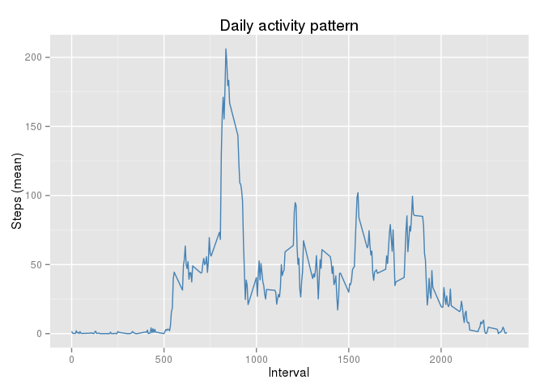

# Reproducible Research: Peer Assessment 1
This document has been generated to resolve Assignment 1 from [**Reproducible Research**](https://www.coursera.org/learn/reproducible-research) Course from Johns Hopkins University

## Loading and preprocessing the data

First we read the data into *Dataset* data frame with columns transformed to appropriate data types. 
We check if the compressed dataset is in the local directory.
If not, we download the file with raw dataset from the original source.


```r
DownloadURL <- 'https://d396qusza40orc.cloudfront.net/repdata%2Fdata%2Factivity.zip'
LocalZipPath <- 'activity.zip'
LocalCsvPath <- 'activity.csv'

if(!file.exists(LocalZipPath)) download.file(DownloadURL, destfile = LocalZipPath)
if(!file.exists(basename(LocalCsvPath))) unzip(LocalZipPath, basename(LocalCsvPath), exdir = './')

## Read csv file to data frame with 17468 rows and 3 columns. Interval column as factor
Dataset <- read.csv2(LocalCsvPath, sep = ",", colClasses=c('interval'='factor'))
```

## What is mean total number of steps taken per day?

### 1. Calculate the total number of steps taken per day
We agregate the total number of steps by date, by adding all the steps registered 
in an interval each day. Results are stored in column *steps* of data frame *StepsbyDayOmitNAs*, 
which summary is printed in html format.


```r
## Ignore missing values in the dataset
DatasetOmitNAs <- Dataset

## Agregate steps by date ignoring missing values
StepsbyDayOmitNAs <- aggregate(DatasetOmitNAs$steps, by=list(day=DatasetOmitNAs$date), FUN=sum, na.rm=TRUE)

## Agregate steps by date
names(StepsbyDayOmitNAs)[2] <- 'steps'

## Print summary of calculations
print(summary(StepsbyDayOmitNAs$steps))
```

```
##    Min. 1st Qu.  Median    Mean 3rd Qu.    Max. 
##       0    6778   10400    9354   12810   21190
```


### 2. If you do not understand the difference between a histogram and a barplot, research the difference between them. Make a histogram of the total number of steps taken each day

We use ggplot2 to print the histogram with a 700 steps binwidth and two vertical lines for the values of the Mean and the Median of the distribution

```r
MeanOmitNAs <- round(mean(StepsbyDayOmitNAs$steps),2)
MedianOmitNAs <- round(median(StepsbyDayOmitNAs$steps),2)

library(ggplot2)
plot1 <- ggplot(data=StepsbyDayOmitNAs, aes(StepsbyDayOmitNAs$steps)) +
        geom_histogram(fill='steelblue', alpha=0.5, binwidth=700) +
        labs(x = 'Steps', y = 'Number of days (frequency)', title = 'Number of Steps (NAs ommited)') +
        geom_vline(aes(xintercept=MeanOmitNAs, color='Mean (NAs ommited)'),
               linetype='dashed', size=1, alpha=0.5, show_guide=TRUE) +
        geom_vline(aes(xintercept=MedianOmitNAs, color='Median (NAs ommited)'),
               linetype='dashed', size=1, alpha=0.5, show_guide=TRUE) +
        scale_color_manual('Statistics', values = c('Mean (NAs ommited)' = 'red', 'Median (NAs ommited)' = 'green'))

print(plot)
```

\


### 3. Calculate and report the mean and median of the total number of steps taken per day. We calculate the values and store in variables for future use.

#### Mean and median of the total number of steps taken per day

```r
print(MeanOmitNAs)
```

```
## [1] 9354.23
```

#### Median of the total number of steps taken per day

```r
print(MedianOmitNAs)
```

```
## [1] 10395
```


## What is the average daily activity pattern?

### 1. Make a time series plot (i.e. type = "l") of the 5-minute interval (x-axis) and the average number of steps taken, averaged across all days (y-axis)

```r
## Agregate steps by interval calculating the mean value and ignoring missing values
MeanbyIntervalOmitNAs <- aggregate(DatasetOmitNAs$steps, by=list(interval=DatasetOmitNAs$interval), FUN=mean, na.rm=TRUE)
names(MeanbyIntervalOmitNAs)[2] <- 'meansteps'

## Order the dataset by interval
MeanbyIntervalOmitNAs <- MeanbyIntervalOmitNAs[order(as.numeric(as.character(MeanbyIntervalOmitNAs$interval))),]

## print a line plot
plot <- ggplot(data=MeanbyIntervalOmitNAs, aes(x=as.numeric(as.character(MeanbyIntervalOmitNAs$interval)), y=MeanbyIntervalOmitNAs$meansteps, group = 1)) + 
        geom_line(color='steelblue') +
        labs(x = "Interval", y = "Steps (mean)", title = "Daily activity pattern") 
print(plot)
```

\


### 2. Which 5-minute interval, on average across all the days in the dataset, contains the maximum number of steps?  


```r
MaxValue <- round(max(MeanbyIntervalOmitNAs$meansteps),2)
MaxInterval <- as.character(MeanbyIntervalOmitNAs[MeanbyInterval$meansteps == max(MeanbyIntervalOmitNAs$meansteps),]$interval)
print(paste0('The maximum value (', MaxValue, ') on average is registered at the ',MaxInterval, 'th interval'))
```

```
## [1] "The maximum value (206.17) on average is registered at the 835th interval"
```

## Imputing missing values

### 1. Calculate and report the total number of missing values in the dataset (i.e. the total number of rows with NAs)

```r
NumberNAs <- nrow(Dataset[!complete.cases(Dataset),])
print(NumberNAs)
```

```
## [1] 2304
```


### 2. Devise a strategy for filling in all of the missing values in the dataset. The strategy does not need to be sophisticated. For example, you could use the mean/median for that day, or the mean for that 5-minute interval, etc.

We will use the mean for that 5-minute interval (*meansteps* column) to fill the NAs.
First we will merge the original *Dataset* data frame with the *MeanbyInterval* data frame by the *interval* column so we can add a new column *meansteps*
Then, we will replace the NAs value of the *steps* column with the value in *meansteps*.
Finally we will remove the *meansteps* column

### 3. Create a new dataset that is equal to the original dataset but with the missing data filled in.

```r
## merge original dataset with means by interval dataset
DatasetFilled <- merge(Dataset, MeanbyIntervalOmitNAs, by='interval', suffixes = c('','.y'))

## Select rounded value to whole number of steps if value is
DatasetFilled[is.na(DatasetFilled$steps),'steps'] <- round(DatasetFilled[is.na(DatasetFilled$steps), 'meansteps'],0)

## Remove meansteps column
DatasetFilled <- DatasetFilled[, 1:3]

## Check there are not NAs
nrow(DatasetFilled[!complete.cases(DatasetFilled),])
```

```
## [1] 0
```


### 4. Make a histogram of the total number of steps taken each day and Calculate and report the mean and median total number of steps taken per day. Do these values differ from the estimates from the first part of the assignment? What is the impact of imputing missing data on the estimates of the total daily number of steps?

```r
## Calculate new values for number of daily steps
StepsbyDayFilled <- aggregate(DatasetFilled$steps, by=list(day=DatasetFilled$date), FUN=sum, na.rm=TRUE)
names(StepsbyDayFilled)[2] <- 'steps'

## Calculate values for the median and the mean with NAs filled
MedianFilled <- round(median(StepsbyDayFilled$steps),2)
MeanFilled <- round(mean(StepsbyDayFilled$steps),2)

plot2 <- ggplot(data=StepsbyDayFilled, aes(StepsbyDayFilled$steps)) +
        geom_histogram(fill='steelblue', alpha=0.5, binwidth=700) +
        labs(x = 'Steps', y = 'Number of days (frequency)', title = 'Number of Steps (NAs filled)') +
        geom_vline(aes(xintercept=MeanFilled, color='Mean (NAs filled)'),
               linetype='dashed', size=1, alpha=0.5, show_guide=TRUE) +
        geom_vline(aes(xintercept=MedianFilled, color='Median (NAs filled)'),
               linetype='dashed', size=1, alpha=0.5, show_guide=TRUE) +
        scale_color_manual('Statistics', values = c('Mean (NAs filled)' = 'red', 'Median (NAs filled)' = 'green'))

## Print both histograms to compare the impact of imputing missing data
library(grid)
library(gridExtra)
grid.arrange(plot1, plot2, top = "Daily steps comparison (NAs omitted vs NAs filled")
```

\

```r
## Print mean and median calculated from filled dataset
print(MedianFilled)
```

```
## [1] 10762
```

```r
print(MeanFilled)
```

```
## [1] 10765.64
```
