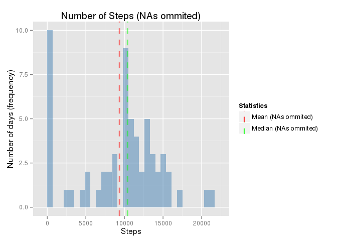

# Reproducible Research: Peer Assessment 1
This document has been generated to resolve Assignment 1 from [**Reproducible Research**](https://www.coursera.org/learn/reproducible-research) Course from Johns Hopkins University

## Loading and preprocessing the data

First we read the data into *Dataset* data frame with columns transformed to appropriate data types. 
We check if the compressed dataset is in the local directory.
If not, we download the file with raw dataset from the original source.


```r
DownloadURL <- 'https://d396qusza40orc.cloudfront.net/repdata%2Fdata%2Factivity.zip'
LocalZipPath <- 'activity.zip'
LocalCsvPath <- 'activity.csv'

if(!file.exists(LocalZipPath)) download.file(DownloadURL, destfile = LocalZipPath)
if(!file.exists(basename(LocalCsvPath))) unzip(LocalZipPath, basename(LocalCsvPath), exdir = './')

## Read csv file to data frame with 17468 rows and 3 columns. Interval column as factor
Dataset <- read.csv2(LocalCsvPath, sep = ",", colClasses=c('interval'='factor'))
```

## What is mean total number of steps taken per day?

### 1. Calculate the total number of steps taken per day
We agregate the total number of steps by date, by adding all the steps registered 
in an interval each day. Results are stored in column *steps* of data frame *StepsbyDayOmitNAs*, 
which summary is printed in html format.


```r
## Ignore missing values in the dataset
DatasetOmitNAs <- na.omit(Dataset) 

## Agregate steps by date ignoring missing values
StepsbyDayOmitNAs <- aggregate(DatasetOmitNAs$steps, by=list(day=DatasetOmitNAs$date), FUN=sum)

## Agregate steps by date
names(StepsbyDayOmitNAs)[2] <- 'steps'

#print summary of calculations 
print(summary(StepsbyDayOmitNAs$steps))
```

```
##    Min. 1st Qu.  Median    Mean 3rd Qu.    Max. 
##      41    8841   10760   10770   13290   21190
```


### 2. If you do not understand the difference between a histogram and a barplot, research the difference between them. Make a histogram of the total number of steps taken each day

We use ggplot2 to print a very simple histogram with a 700 steps binwidth

```r
library(ggplot2)
plot <- ggplot(data=StepsbyDayOmitNAs, aes(StepsbyDayOmitNAs$steps)) + 
        geom_histogram(fill='steelblue', binwidth=700) +
        labs(x = "Steps", y = "Number of days (frequency)", title = "Number of Steps")
print(plot)
```

\


### 3. Calculate and report the mean and median of the total number of steps taken per day
We calculate the values and store in variables for future use.

#### Mean and median of the total number of steps taken per day

```r
MeanOmitNAs <- mean(StepsbyDayOmitNAs$steps)
print(MeanOmitNAs)
```

```
## [1] 10766.19
```

#### Median of the total number of steps taken per day

```r
MedianOmitNAs <- median(StepsbyDayOmitNAs$steps)
print(MedianOmitNAs)
```

```
## [1] 10765
```


## What is the average daily activity pattern?

### 1. Make a time series plot (i.e. type = "l") of the 5-minute interval (x-axis) and the average number of steps taken, averaged across all days (y-axis)


### 2. Which 5-minute interval, on average across all the days in the dataset, contains the maximum number of steps?


## Imputing missing values

### 1. Calculate and report the total number of missing values in the dataset (i.e. the total number of rows with NAs)


### 2. Devise a strategy for filling in all of the missing values in the dataset. The strategy does not need to be sophisticated. For example, you could use the mean/median for that day, or the mean for that 5-minute interval, etc.


### 3. Create a new dataset that is equal to the original dataset but with the missing data filled in.


### 4. Make a histogram of the total number of steps taken each day and Calculate and report the mean and median total number of steps taken per day. Do these values differ from the estimates from the first part of the assignment? What is the impact of imputing missing data on the estimates of the total daily number of steps?


## Are there differences in activity patterns between weekdays and weekends?
### 1. Create a new factor variable in the dataset with two levels – “weekday” and “weekend” indicating whether a given date is a weekday or weekend day.


### 2. Make a panel plot containing a time series plot (i.e. type = "l") of the 5-minute interval (x-axis) and the average number of steps taken, averaged across all weekday days or weekend days (y-axis). See the README file in the GitHub repository to see an example of what this plot should look like using simulated data.

